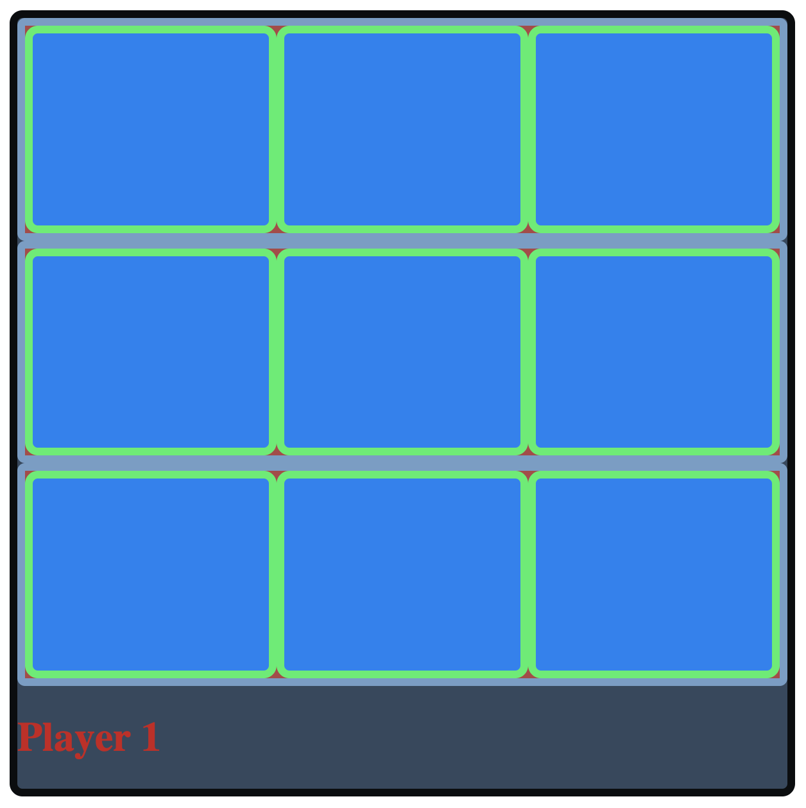
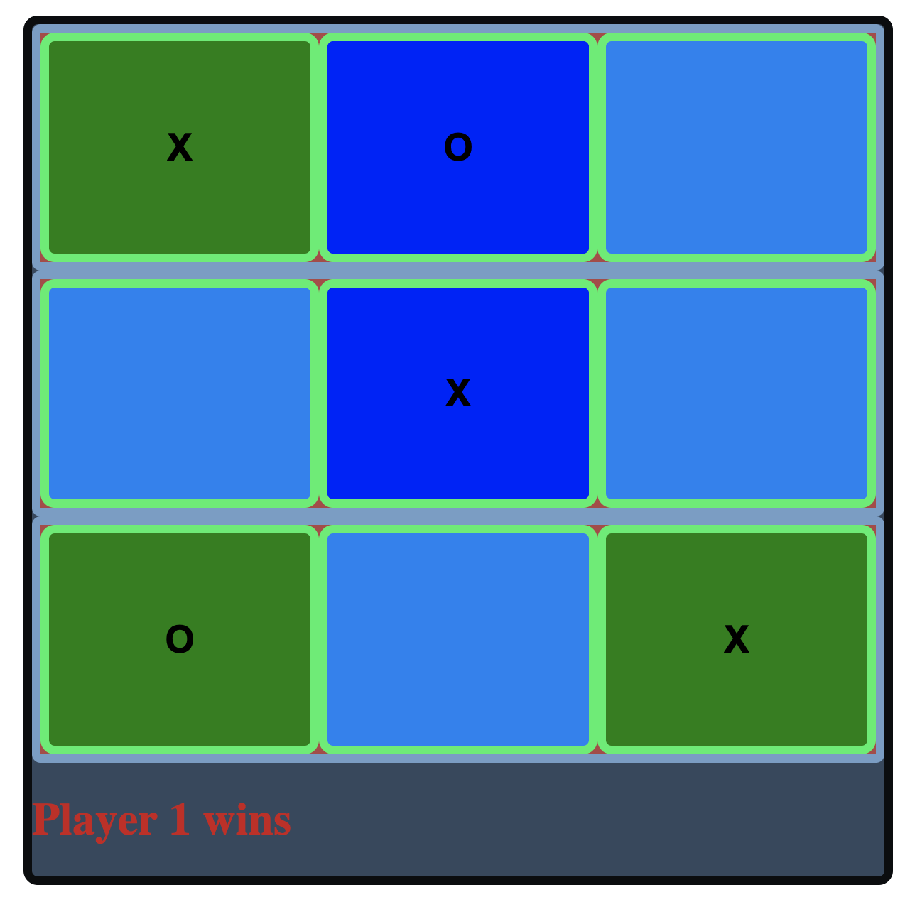

# Tik-Tak-Toe game

## Description Of The Project:
Simple Tik-Tak-Toe game

## How To Run:
1. Download files to your local machine
2. Run http server
3. Go to browser to local server
4. Start to click on the squares and continue to play with your friend until one of you wins

## Roadmap Of Future Improvements:
1. Make the winner line to change a color into yellow 
2. Add a condition so only one click will be available per square

## License Information:
MIT License

 

